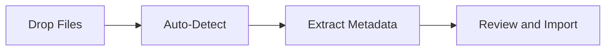

> [!NOTE]
> Booklib is an independent fork of Grimmory, itself a fork of Booklore.

<div align="center">

# Booklib

**Booklib is a self-hosted digital library for people who take their reading seriously.**

[](LICENSE)

[Quick Start](#quick-start) · [Documentation](docs/) · [Releases](https://github.com/prakunin/booklib/releases)

</div>

---

## Features

| Feature | Description |
| :--- | :--- |
| **Smart Shelves** | Custom and dynamic shelves with rule-based filtering, tagging, and full-text search |
| **Metadata Lookup** | Covers, descriptions, reviews, and ratings pulled from Google Books, Open Library, and Amazon, all editable |
| **Built-in Reader** | Read PDFs, EPUBs, and comics in the browser with annotations, highlights, and reading progress tracking |
| **Device Sync** | Connect a Kobo, use any OPDS-compatible app, or sync progress with KOReader |
| **Multi-User** | Separate shelves, progress, and preferences per user with local or OIDC authentication |
| **BookDrop** | Drop files into a watched folder and Booklib detects, enriches, and queues them for import automatically |
| **One-Click Sharing** | Send any book to a Kindle, an email address, or another user directly from the interface |

### Supported Formats

| Category | Formats |
| :--- | :--- |
| eBooks | EPUB, MOBI, AZW, AZW3, FB2 |
| Documents | PDF |
| Comics | CBZ, CBR, CB7 |
| Audiobooks | M4B, M4A, MP3, OPUS |

---

## Quick Start

> [!TIP]
> For OIDC setup, reverse-proxy auth, and other advanced topics, see the guides under [`docs/`](docs/).

Booklib ships as a single all-in-one container built from this repository. Requirements: [Docker](https://docs.docker.com/get-docker/), [Docker Compose](https://docs.docker.com/compose/install/), and a local clone of this repo.

```bash
git clone https://github.com/prakunin/booklib.git
cd booklib
```

### Step 1: Environment Configuration

Create a `.env` file:

```ini
# Application
APP_USER_ID=1000
APP_GROUP_ID=1000
TZ=Etc/UTC

# Database
DATABASE_URL=jdbc:mariadb://mariadb:3306/booklib
DB_USER=booklib
DB_PASSWORD=ChangeMe_Booklib_2025!

# Optional: enable API docs + export OpenAPI JSON (defaults to false)
API_DOCS_ENABLED=false

# Storage: LOCAL (default) or NETWORK (disables file operations; see Network Storage section)
DISK_TYPE=LOCAL

# MariaDB
MYSQL_ROOT_PASSWORD=ChangeMe_MariaDBRoot_2025!
MYSQL_DATABASE=booklib
```

### Step 2: Docker Compose

The image is built locally from the repository via `build: .` — no external registry is required.

> [!NOTE]
> Migrating from an existing Booklore or Grimmory container? Keep your current `container_name`, database name and user, ports, and mounted volumes the same. Replace only the `image:` line with `build: .` and run `docker compose up -d --build`.

Create a `docker-compose.yml` or copy and adapt [`deploy/compose/docker-compose.yml`](deploy/compose/docker-compose.yml):

```yaml
services:
  booklib:
    build: .
    container_name: booklib
    environment:
      - USER_ID=${APP_USER_ID}
      - GROUP_ID=${APP_GROUP_ID}
      - TZ=${TZ}
      - DATABASE_URL=${DATABASE_URL}
      - DATABASE_USERNAME=${DB_USER}
      - DATABASE_PASSWORD=${DB_PASSWORD}
      - API_DOCS_ENABLED=${API_DOCS_ENABLED}
      - DISK_TYPE=${DISK_TYPE}
    depends_on:
      mariadb:
        condition: service_healthy
    ports:
      - "6060:6060"
    volumes:
      - ./data:/app/data
      - ./books:/books
      - ./bookdrop:/bookdrop
    healthcheck:
      test: wget -q -O - http://localhost:6060/api/v1/healthcheck
      interval: 60s
      retries: 5
      start_period: 60s
      timeout: 10s
    restart: unless-stopped

  mariadb:
    image: mariadb:12.3.2
    environment:
      - TZ=${TZ}
      - MYSQL_ROOT_PASSWORD=${MYSQL_ROOT_PASSWORD}
      - MYSQL_DATABASE=${MYSQL_DATABASE}
      - MYSQL_USER=${DB_USER}
      - MYSQL_PASSWORD=${DB_PASSWORD}
    volumes:
      - ./mariadb/data:/var/lib/mysql
    restart: unless-stopped
    healthcheck:
      test: ["CMD", "mariadb-admin", "ping", "-h", "localhost"]
      interval: 5s
      timeout: 5s
      retries: 10
```

> **Upgrading from an older release?** Grimmory now uses the official MariaDB image instead of the
> linuxserver one, which stores data in a different directory. See
> [docs/UPGRADING-MARIADB-12.md](docs/UPGRADING-MARIADB-12.md) before pulling.

### Step 3: Launch

```bash
docker compose up -d --build
```

Open http://localhost:6060, create your admin account, and start building your library. (All libraries must be created within directories mounted on the host, e.g. the `/books/` directory in the sample `docker-compose.yml` above.)

Additional deployment examples:

- Docker Compose: [`deploy/compose/docker-compose.yml`](deploy/compose/docker-compose.yml)
- Helm: [`deploy/helm/grimmory/Chart.yaml`](deploy/helm/grimmory/Chart.yaml)
- Podman Quadlet: [`deploy/podman/quadlet/README.md`](deploy/podman/quadlet/README.md)

---

## Developer Surfaces

Contributor workflow, PR policy, and release semantics live in [CONTRIBUTING.md](CONTRIBUTING.md).

General purpose development guidelines live in [DEVELOPMENT.md](DEVELOPMENT.md). Component-specific implementation guidance lives in:

- [`backend/DEVELOPMENT.md`](backend/DEVELOPMENT.md)
- [`frontend/DEVELOPMENT.md`](frontend/DEVELOPMENT.md)

The root [`Justfile`](Justfile) is the primary local command surface and mirrors the folder-local `backend/Justfile` and `frontend/Justfile` entrypoints.

```bash
just               # Show root + api + ui recipes
just test          # Run backend and frontend tests
just api test      # Run backend tests only
just ui dev        # Start the frontend dev server
```

---

## API Reference Docs

When enabled via `API_DOCS_ENABLED`, API reference documentation is available as both an `openapi.json` and as publicly accessible docs. The endpoints are:
- API reference docs are available at `http://localhost:6060/api/docs`
- OpenAPI JSON is available at `http://localhost:6060/api/openapi.json`

---

## BookDrop

Drop book files into a watched folder. Booklib picks them up, pulls metadata, and queues them for your review.



| Step | What Happens |
| --- | --- |
| 1. Watch | Booklib monitors the BookDrop folder continuously |
| 2. Detect | New files are picked up and parsed automatically |
| 3. Enrich | Metadata is fetched from Google Books and Open Library |
| 4. Import | You review, adjust if needed, and add to your library |

Mount the volume in `docker-compose.yml`:

```yaml
volumes:
  - ./bookdrop:/bookdrop
```

---

## Network Storage

Set `DISK_TYPE=NETWORK` in your `.env` to run Booklib against a network-mounted file system (NFS, SMB, etc.).
In this mode, direct file operations (delete, move, rename from the UI) are disabled to avoid destructive changes on shared mounts.
All other features — reading, metadata, sync — remain fully functional.

---

## Community and Support

| Channel | |
| :--- | :--- |
| Report a bug | [Open an issue](https://github.com/prakunin/booklib/issues/new/choose) |
| Request a feature | [Open an issue](https://github.com/prakunin/booklib/issues/new/choose) |
| Contribute | [Contributing Guide](CONTRIBUTING.md) |

> [!WARNING]
> Before opening a pull request, open an issue first and get maintainer approval. Pull requests without a linked issue, without screenshots or video proof, or without pasted test output will be closed. All code must follow the project [backend](CONTRIBUTING.md#backend-conventions) and [frontend](CONTRIBUTING.md#frontend-conventions) conventions. AI-assisted contributions are welcome, but you must run, test, and understand every line you submit. See the [Contributing Guide](CONTRIBUTING.md) for full details.

---

## License

Distributed under the terms of the [AGPL-3.0 License](LICENSE).
